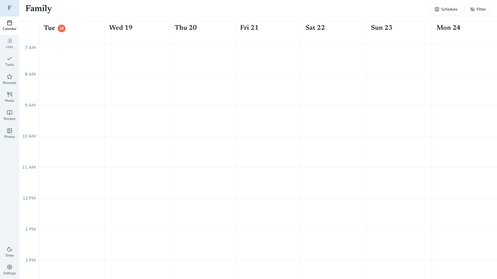

# FamilyOS

A kitchen-wall kiosk for one household. v1 is a week calendar that reads and writes a Google Calendar you pick in Settings. Other nav items (Lists, Tasks, and the rest) are stubs.

It is not a hosted app, not multi-tenant, and not a phone UI. You run Next.js on a computer you control; a wall panel is optional.



`docs/calendar.png` is a 1920×1080 capture of the running app (`pnpm dev`, then screenshot `/`).

## Quick start

**Node.js 20.9+** and **pnpm 10**. Full walkthrough (OAuth, production bind, Pi kiosk, touchscreen): [INSTALL.md](INSTALL.md).

```bash
pnpm install
# create .env.local with GOOGLE_CLIENT_ID / GOOGLE_CLIENT_SECRET
# Calendar API on; redirect URI http://localhost:3000/api/auth/callback/google
pnpm dev
```

Open [http://localhost:3000](http://localhost:3000) → **Settings** → sign in → pick the family calendar.

For a panel on the LAN, `pnpm build && pnpm start` (binds `0.0.0.0:3000`). `pnpm dev` over Wi-Fi makes taps feel late.

## Touchscreen

Laid out for a **1080p landscape** capacitive panel, read from across a kitchen. Mouse/trackpad in a desktop browser is fine for development. Phones are not a target.

The intended wall stack is a Raspberry Pi 5 running [FullPageOS](https://github.com/guysoft/FullPageOS) (Chromium kiosk). Picture is HDMI; touch is a separate USB HID cable. Reference hardware is a CAPERAVE CF15T + Goodix digitizer. Compatibility, cables, and what will not work: [INSTALL.md](INSTALL.md#touchscreen-compatibility). FullPageOS setup: [docs/kiosk.md](docs/kiosk.md).

## Docs

- [INSTALL.md](INSTALL.md) — clone, Google OAuth, wall kiosk, touchscreen
- [docs/kiosk.md](docs/kiosk.md) — FullPageOS Chromium, OSK extension, idle dim
- [docs/requirements.md](docs/requirements.md) — v1 scope
