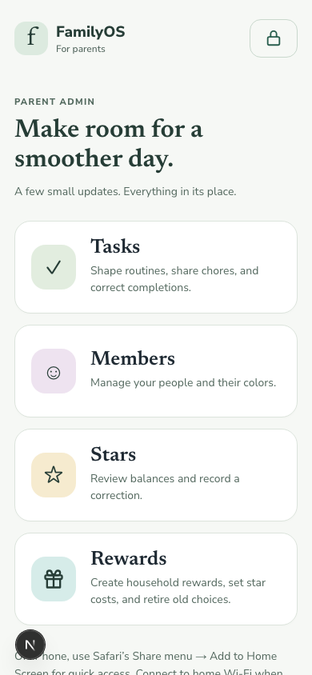
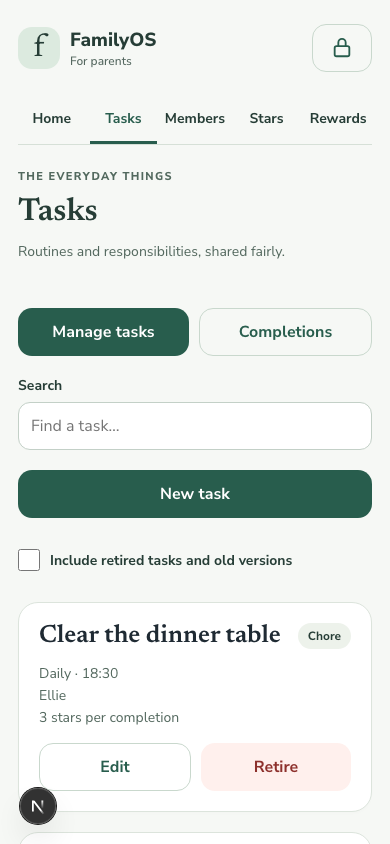
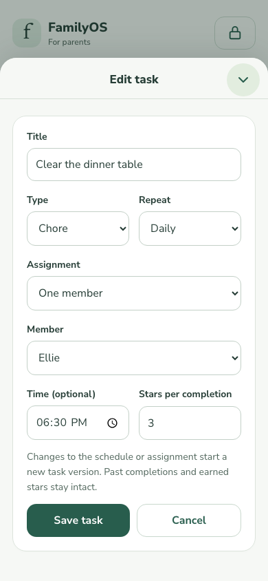
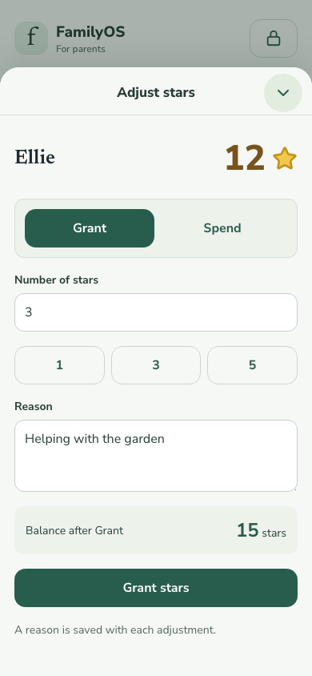

# Parent admin

Open `/admin` on an iPhone connected to the household Wi-Fi. It has its own
mobile layout and does not require display pairing. It has no link in the wall
navigation. Existing paired displays keep their existing permissions.

Set `FAMILYOS_ADMIN_PIN` to exactly six digits in the server's environment or
`.env.local`, then restart the server. Keep the value server-side; do not use a
`NEXT_PUBLIC_` variable. If unset or malformed, admin access is disabled.
Changing the PIN invalidates existing admin sessions. The PIN cannot be changed
from the browser.

The interface uses the existing HTTP server. In Safari, use **Share → Add to
Home Screen** and open it as a web app. The manifest, standalone metadata, and
iPhone icons are scoped to `/admin`. Editing requires a connection; there is no
service worker, offline data cache, or queued editing. The wall retains its own
layout, pairing, scaling, and dimming.

## Access

- Sessions use random, HttpOnly, SameSite=Strict cookies. The server stores only
  credential hashes in `admin.sqlite` under `FAMILYOS_DATA_DIR` (default `data/`).
- Every admin data request checks session expiry on the server. Reading data
  does not renew a session. Foreground interaction renews it, at most once per
  ten seconds. Fifteen minutes without activity locks access; the **lock icon**
  (accessible label “Lock now”) also
  revokes the server session. The browser clears protected screens on expiry
  and checks access when returning from the background.
- Five failed attempts on a device start a five-minute cooldown. Fifty failed
  attempts across devices in five minutes start a server-wide five-minute
  cooldown. Attempts and cooldowns survive server restarts.
- Mutations require a matching Origin and an admin request header. Paired
  display credentials do not authorize admin endpoints. API responses use
  `Cache-Control: no-store`.

## Editing local data

New commits on `main` deploy themselves within about two minutes
(`docs/kiosk.md`, “Continuous deployment”), so the admin **Update** card is
rarely needed. The home page checks when opened and shows the card only when
`origin/main` has commits the live release lacks: usually the short window
before auto-deploy runs, or after a deploy failed or was rolled back, which
auto-deploy does not retry. `./scripts/macos-server check-update` fetches
`origin/main` and compares history without changing the checkout. A failed
check offers a retry instead of showing an Update button.

The **Update** button starts `./scripts/macos-server deploy` through its
separate macOS update job (`kick-update`), so it survives the server restart.
It builds `origin/main` as a new release beside the running one, switches,
restarts FamilyOS, and rolls back automatically if the new release never
becomes ready. “Update started” confirms launch, not completion; refresh after
a few minutes. Logs are `~/Library/Logs/familyos-update.log` and
`~/Library/Logs/familyos-update.err.log`. Wall **Settings** intentionally has
the same **Update** button, which starts the same job. Rolling back is a
household Mac command: `./scripts/macos-server rollback`.

**Tasks:** create, edit, and retire; manage once/daily/weekly/monthly schedules,
fixed/rotation assignments, type, optional time, and star value. Title,
type, time, and stars edit in place. Schedule or assignment changes atomically
retire the old definition and create one with the same lineage. Rotations
preserve the next surviving person's turn. Retired definitions remain visible
under “Include retired tasks and old versions.” Past one-time definitions also
require “Include past one-time tasks”; task-list filters combine. Editing a
replaced definition requires refreshing; a stale phone cannot revive an old
version.

**Bounties:** create, edit, and retire Chores any Active Member can claim; set
the Star reward and a Once or recurring schedule. Bounty creation and
management exist only in admin; the wall shows available Bounties without an
admin link. Lifecycle rules are in the
[Bounties design](design/bounties-design-spec.md).

**Members:** create and edit names/colors, or retire. IDs remain stable and
retirement preserves history. The existing six-active-member and unique-color
rules apply. Retiring a member retires fixed tasks and removes them from
rotations (retiring an empty rotation). The roster is written atomically with
serialized version checks. Task reconciliation runs after saving the roster and
before task reads, so interruption between the JSON and SQLite writes recovers
on the next read without creating duplicate replacements.

**Completion corrections:** record a reason to undo, restore, or reattribute an
existing completion. Original events stay immutable. An append-only correction
overrides the completion in the current projection and reverses/transfers the
stars credited at the original completion. Undo appears as skipped on the wall,
since its immutable completion receipt cannot be inserted a second time; parents
can restore it from admin. A stale correction is rejected. Corrections to retired
task versions do not rewrite the rotation of their replacement.

**Stars:** view active and retired members' balances and record a nonzero Grant
or Spend with a reason. The balance cannot become negative or exceed the safe
integer limit. Retries with the same adjustment/correction ID do not apply twice.
If a completion's stars have already been spent, reversing it requires enough
balance first; no partial correction is saved. Adjustment history and completion
history remain separate.

**Rewards:** create household choices, edit their names, descriptions, icons and
positive star costs, or retire them. Retirement clears selected goals and keeps
previous Spend details. The wall Rewards screen handles goal selection and
spending. See [Rewards](rewards.md). Rewards owed and delivery are deferred to
[issue #82](https://github.com/zulrang/familyos/issues/82).

Calendar, Google lists, photos, and system settings are not part of this admin release.

## Mobile workflow

The home screen links to Tasks, Bounties, Members, Stars, and Rewards. Section
navigation stays available on list pages. Create/edit actions for Tasks, Members, and
Rewards open a rounded drawer covering 90% of the viewport. In Stars, select a
member and choose **Adjust balance** to open the same drawer for Grant/Spend.

The drawer slides up while the backdrop fades in. The list remains visible
underneath, preserving its content and scroll position, but cannot be interacted
with while the drawer is open. The form scrolls independently beneath a fixed
title bar. Use the circular down-chevron button at the top right to dismiss it;
the drawer slides down as the backdrop fades out. Cancel controls use the same
transition. Close is disabled during a save, and reduced-motion preferences
skip the animations. A successful save closes the drawer and reloads its data.
Completion corrections remain inline under Tasks → Completions.

Opening or refreshing a normal admin route shows its page, not a new-task form.
The development preview wrapper can automatically sign in and open **New task**
to demonstrate the drawer; those behaviors belong only to the temporary wrapper.

## Screenshots

Captured from the actual admin routes on 2026-09-11 at a 390 × 844 mobile viewport.
Names, tasks, and balances are browser-only sample data, not household records.
These show the web interface, not a native iOS app or Safari's browser chrome.

| Admin home | Task list |
| --- | --- |
|  |  |

| Task editor | Star adjustment |
| --- | --- |
|  |  |

## Task storage migration

The first task-store open upgrades SQLite to version 2 transactionally. Following
ADR 0007, stored balances start at zero without backfilling old completions or
adjustments. Original definitions and events remain intact. New completions
credit their stored star value exactly once, including late events for retired
definitions. Changing a task's star value does not revalue existing balances.
Legacy completions have no stored credit to reverse when corrected.

## Development preview

For a phone-sized browser preview served from the Mac to a remote PC, follow
[Mobile admin preview](agents/mobile-preview.md). It uses isolated temporary data.

## Reusing form drawers

Create/edit forms use `src/shared/AdminEditorScreen.tsx`. Wrap the form inside
this component where its saving state is owned:

```tsx
<AdminEditorScreen
  title="Edit member"
  backLabel="Members"
  onBack={onCancel}
  busy={save.status === "saving"}
>
  {(close) => (
    <form onSubmit={submit}>
      {/* Fields and save action */}
      <button type="button" disabled={save.status === "saving"} onClick={close}>
        Cancel
      </button>
    </form>
  )}
</AdminEditorScreen>
```

The shared component provides a 90%-height bottom drawer with rounded top corners,
a fixed title bar with a circular down-chevron close button on the right, its own
scrolling content area, safe-area spacing, initial heading focus, and reduced-motion
support. The browser makes the underlying admin shell inert.
The close button, Escape, and the render callback's `close` slide the drawer down before
calling `onBack`. `backLabel` supplies the close button’s accessible destination
label and is not shown as button text; dismissal is blocked while `busy` or already
closing. Reduced motion skips the animation. Pass ordinary React children when no additional
close control is needed. The form owns validation, persistence, save/cancel
actions, and any discard confirmation.
Keep the list mounted and render the drawer alongside it while editing, so the
background content and scroll position survive opening and dismissal. Dismiss
the drawer on successful save or cancellation; avoid replacing the list with an
early return for the editor.
